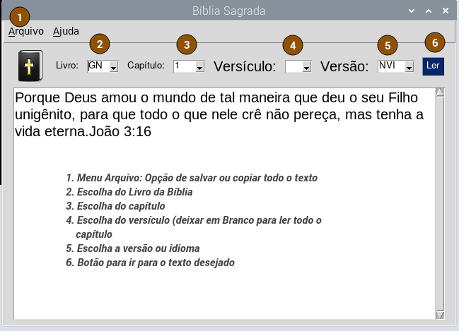

# Bíblia Sagrada em Python

Olá é com muita satisfação que apresento esta versão da Bíblia Sagrada totalmente em Python e com diversas versões.

Este software usa a Biblioteca PySimpleGui para exibição gráfica e as libs beautifulsoup4 e requests para webscraping na internet atrás de texto bíblico...

## Como Instalar a Bíblia Sagrada 

Clone este repositório:
 
~~~python

git clone https://github.com/elizeubarbosaabreu/BibliaSagrada

~~~

Navegue até o diretório com o comando:
 
~~~python

cd BibliaSagrada/

~~~

Crie uma máquina virtual. No windows use *python -m venv .venv*:
 
~~~python

python3 -m venv .venv

~~~

Ative a máquina virtual. No windows o comando *source .venv\Script\activate.bat* :
 
~~~python

source .venv/bin/activate

~~~

Note que apareceu um (.venv) antes do nome do usuário no terminal. Agora instale as bibliotecas e dependências:
 
~~~python

pip install -r requeriments.txt

~~~

Agora teste com o comando:
 
~~~python

python app.py

~~~

## Transforme o arquivo app.py em executável

Agora para transformar a Bíblia em Software rode os comandos abaixo:
 
~~~python

pyinstaller app.py

~~~

Renomeie a pasta **APP** que estará dentro da pasta **dist** e mova-a para o disco D: ou outro.  
Crie um atalho para o menu (varia muito entre os diferentes sistemas operacionais)

## Raspberry Pi

No Raspberry Pi, após transformar o app.py em executável com o passo acima, eu movo para a pasta */opt* com o comando abaixo e uso o alarcate para criar o menu:

~~~python

sudo mv dist/app /opt/BibliaSagrada

~~~

No diretorio */home/<nome_do_usuario>/.local/share/aplication* ,crio um arquivo chamado 'Biblia Sagrada.desktop'

~~~python

[Desktop Entry]
Name=Bíblia Sagrada
Exec=/opt/BibliaSagrada/app
Comment=biblia sagrada
Terminal=false
Icon=/opt/BibliaSagrada/tk/images/logo64.gif
Type=Application

~~~
 

## Pronto você tem uma Bíblia em Python super leve em seu computador.
